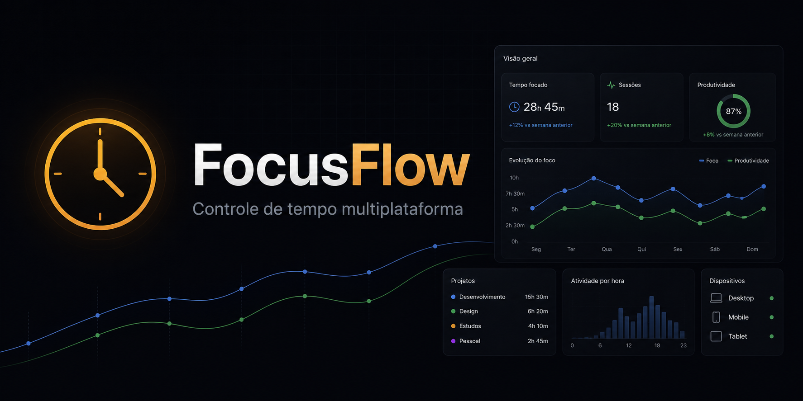
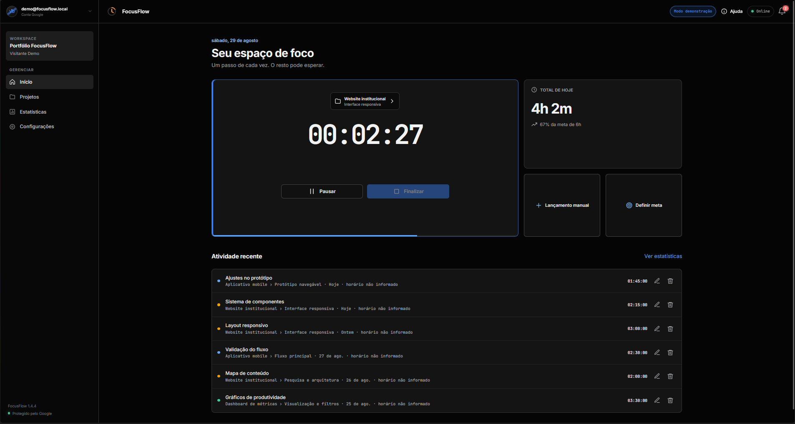
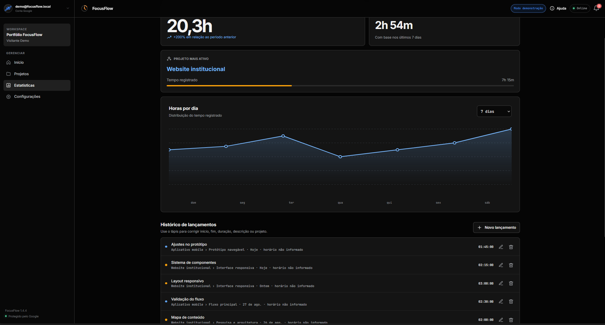

# FocusFlow

[](https://github.com/ninex9x/focusflow/actions/workflows/build-clients.yml)
[](https://github.com/ninex9x/focusflow/actions/workflows/secret-scan.yml)



[**▶ Abrir demonstração online**](https://ninex9x.github.io/focusflow/)

| Tela inicial | Estatísticas |
| --- | --- |
|  |  |

Aplicativo de controle de tempo e projetos com clientes para web/PWA, Windows,
Linux e Android. O backend centraliza regras de negócio, sincronização e
persistência em SQLite.

> Projeto de portfólio full stack: interface responsiva, domínio no backend,
> autenticação, persistência, clientes nativos, testes e CI no mesmo produto.

[Estudo de caso](app/docs/CASE_STUDY.md) ·
[Roadmap](app/docs/ROADMAP.md) ·
[Releases](https://github.com/ninex9x/focusflow/releases)

## Recursos

- cronômetro com pausa, retomada, finalização e revisão;
- lançamentos manuais no horário de Brasília;
- projetos, prazos, estimativas e subtarefas;
- proteção contra horários sobrepostos e mais de 24 horas registradas no dia;
- painel responsivo com métricas e gráficos;
- notificações de metas, riscos, prazos e cronômetros esquecidos;
- exportação em CSV e JSON;
- sincronização entre os clientes pelo mesmo backend;
- interface responsiva em modo escuro.

## Início rápido

### Requisitos

- Node.js 22.13 ou superior;
- npm 10 ou superior;
- Git.

### Executar localmente

```bash
git clone https://github.com/ninex9x/focusflow.git
cd focusflow/app
npm install
npm run dev
```

O comando inicia a interface, a API e o SQLite. O banco local é criado em
`data/focusflow.sqlite`, diretório ignorado pelo Git. Não é necessário criar um
arquivo `.env`, configurar Cloudflare ou instalar um banco separado.

Todos os comandos npm, Docker e Gradle das próximas seções consideram o
diretório `app/` como diretório atual.

O modo local:

- escuta apenas em `127.0.0.1`;
- usa o perfil `Usuário local`;
- mantém os dados somente na máquina;
- executa sem autenticação externa.

### Explorar com dados de demonstração

O modo demonstração preenche o produto com projetos e registros fictícios. Cada
navegador recebe uma sessão anônima isolada, armazenada somente em memória; tudo
é apagado quando o servidor reinicia.

[**Experimentar agora no navegador**](https://ninex9x.github.io/focusflow/)

A demonstração pública funciona sem instalação e mantém alterações somente na
aba atual. Os comandos abaixo servem apenas para quem quiser executar a mesma
demo localmente durante o desenvolvimento.

No PowerShell:

```powershell
$env:DEMO_MODE="true"
npm run dev
```

No Linux ou macOS:

```bash
DEMO_MODE=true npm run dev
```

A faixa **Modo demonstração** identifica esse ambiente. O comando “Redefinir
dados” restaura a vitrine original.

## Comandos

| Comando | Descrição |
| --- | --- |
| `npm run dev` | Inicia interface, API e SQLite em `127.0.0.1:3000` |
| `npm start` | Inicia a aplicação completa, igual ao modo local |
| `npm run dev:web` | Serve somente a interface em `127.0.0.1:4173` |
| `npm test` | Executa os testes automatizados |
| `npm run build` | Gera a versão web estática em `dist/` |
| `npm run desktop:windows` | Gera o instalador NSIS no Windows |
| `npm run desktop:linux` | Gera os pacotes AppImage e DEB no Linux |

## Arquitetura

```text
Web / PWA ─────┐
Windows/Linux ─┼──> API Node.js ──> regras de negócio ──> SQLite
Android ───────┘
```

Os clientes apresentam a interface e enviam comandos para a API. Validações,
estatísticas, notificações e persistência são processadas no backend.

Principais endpoints:

| Método | Endpoint | Finalidade |
| --- | --- | --- |
| `GET` | `/api/health` | Verifica a integridade do serviço |
| `GET` | `/api/auth` | Retorna a identidade validada pelo backend |
| `GET` | `/api/state` | Carrega o estado e a revisão atuais |
| `POST` | `/api/action` | Executa uma ação com controle de concorrência |
| `GET` | `/api/export` | Exporta os registros em CSV ou JSON |

## Executar com Docker

Docker Compose inicia a aplicação e um Nginx sem privilégios. O SQLite fica em
um volume persistente e a porta é exposta somente no computador local.

```bash
docker compose up -d --build
```

Abra [http://127.0.0.1:8091](http://127.0.0.1:8091).

Para acompanhar ou encerrar:

```bash
docker compose logs -f
docker compose down
```

## Configuração de produção

O modo de produção pode usar Cloudflare Tunnel e Cloudflare Access. Copie o
modelo e mantenha os valores reais somente no ambiente privado:

```bash
cp .env.example .env
```

| Variável | Obrigatória | Descrição |
| --- | --- | --- |
| `REQUIRE_ACCESS_AUTH` | Não | Use `true` para ativar o Cloudflare Access |
| `DEMO_MODE` | Não | Usa sessões temporárias e dados totalmente fictícios |
| `TEAM_DOMAIN` | Com autenticação | Domínio da equipe no Cloudflare Access |
| `POLICY_AUD` | Com autenticação | Audiência da política do Access |
| `ALLOWED_ORIGINS` | Não | Origens adicionais, separadas por vírgula |
| `LEGACY_OWNER_EMAIL` | Não | Migração controlada de dados legados |

Quando `REQUIRE_ACCESS_AUTH=true`, o backend valida assinatura, emissor,
expiração e audiência do JWT enviado pelo Cloudflare Access. Cada identidade
possui dados isolados no SQLite. O e-mail do perfil vem da conta autenticada e
não pode ser alterado pelo cliente.

Nunca envie `.env`, tokens, bancos SQLite, certificados, instaladores ou chaves
de assinatura ao Git.

## Windows e Linux

O cliente desktop usa Electron e mantém a sessão OAuth cifrada pelo cofre do
sistema. O login é aberto no navegador padrão, fora da janela do aplicativo.

```bash
npm run desktop:icon
npm run desktop:windows
```

No Linux:

```bash
npm run desktop:icon
npm run desktop:linux
```

Os artefatos são gravados em `release/`:

- Windows: instalador NSIS `.exe`;
- Linux: `.AppImage` e `.deb`.

## Android

O projeto Android requer JDK 17 e Android SDK 34.

No Linux ou macOS:

```bash
cd android
./gradlew assembleDebug
```

No Windows:

```powershell
cd android
.\gradlew.bat assembleDebug
```

O APK é gerado em `android/app/build/outputs/apk/debug/app-debug.apk`.

## Estrutura do projeto

```text
.github/                 workflows e política de segurança
app/
├── android/             cliente Android nativo
├── deploy/              Dockerfile e configuração do Nginx
├── desktop/             shell Electron, OAuth e atualizador
├── docs/                documentação complementar
├── scripts/             build e publicação de atualizações
├── server/              API, autenticação e regras de negócio
├── tests/               testes automatizados
├── updates/             catálogo local de atualizações
├── web/                 interface, estilos, ícones e manifesto PWA
└── compose.yaml         ambiente Docker local
README.md                apresentação e início rápido
```

## Qualidade e segurança

Cada push e pull request executa:

- testes da API, domínio, OAuth, interface e atualizações;
- build da versão web;
- geração de APK, EXE, AppImage e DEB;
- varredura de segredos com Gitleaks.

Leia [.github/SECURITY.md](.github/SECURITY.md) antes de publicar uma alteração. Vulnerabilidades
devem ser relatadas de forma privada por um GitHub Security Advisory, nunca em
uma issue pública.

O processo de atualização dos clientes desktop está documentado em
[app/docs/UPDATES.md](app/docs/UPDATES.md).

## Contribuindo

1. Crie uma branch para a alteração.
2. Implemente a mudança sem adicionar dados ou credenciais reais.
3. Execute `npm test` e `npm run build`.
4. Abra um pull request descrevendo o comportamento alterado.

Consulte também [.github/CONTRIBUTING.md](.github/CONTRIBUTING.md) e use os
templates de issue e pull request. O repositório ainda não declara uma licença;
por isso, a publicação do código não concede automaticamente permissão de uso,
modificação ou redistribuição.
